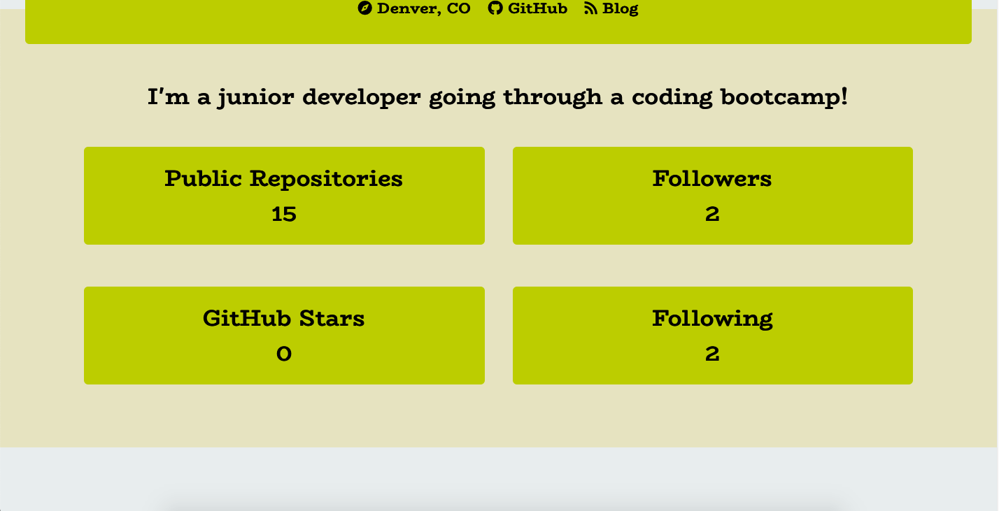

# unit-seven-homework

Github Profile Builder

In this program, a user can dynamically generate both an HTML and PDF version of a simple profile based on information pulled from the user's GitHub API.  With four color options and a variety of information pulled from the API, the profile produced is useful and aesthetically pleasing.

This program is useful to anyone who would like to be able to generate a quick and effective profile for use in a job hunt or networking so 
they can showcase the breadth of their previous work.

Link to repo:
[https://github.com/BestBroBradley/unit-seven-homework](https://github.com/BestBroBradley/unit-seven-homework)

# Functionality:

In the command line, the user will input their preferred color-scheme and their GitHub username.  The file will then make an API call to retreive a variety of information from the user's GitHub profile, including:

-name
-location
-current workplace
-link to github profile
-link to blog page
-short user-provided bio
-number of repositories
-number of followers
-number of GitHub Stars
-number of other users following

The program will then insert that information along with the chosen color scheme into a dynamically-created framework of HTML and CSS.

Top half of generated HTML:

Bottom half of generated HTML:

Final PDF:

# Third-party items used:

GitHub API
[https://developer.github.com/v3/](https://developer.github.com/v3/)

Axios npm
[https://www.npmjs.com/package/axios](https://www.npmjs.com/package/axios)

Inquirer npm
[https://www.npmjs.com/package/inquirer](https://www.npmjs.com/package/inquirer)

HTML-PDF npm
[https://www.npmjs.com/package/html-pdf](https://www.npmjs.com/package/html-pdf)

